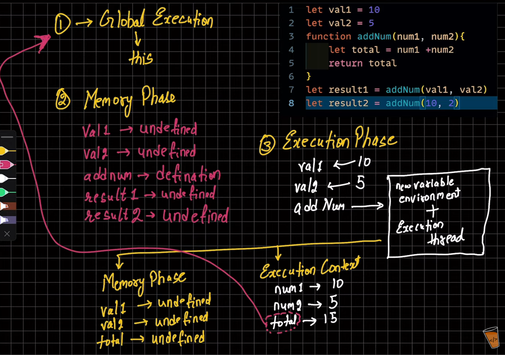

## Lecture 23: JavaScript Behind the Scenes (VERY IMPORTANT FOR INTERVIEW)

- JavaScript Execution Context: Every compiler has a different execution context.
  - Node.js has a different execution context.
  - 'bun' has a different execution context.
  - The browser has a different execution context.

- Remember how the call stack works in JavaScript.
- JavaScript Execution Context: It means how the JavaScript code you write will run.
- JavaScript has 2 execution contexts:
  1. Global Execution Context: It is stored in `this`, executed in a single thread. Remember, JavaScript is a single-threaded language.
     - In the browser, `this` contains the Document object.
     - In Node.js, `this` contains an empty object `{}`.
  2. Functional Execution Context

- JavaScript runs the code in 2 phases:
  1. Memory Creation Phase:
     - Memory is created for variables and functions declared, but they are not executed here.
     - Variables are created and initialized with `undefined` values.
  2. Execution Phase:
     - Values are assigned to the variables.

- Let's see with an example:
    
    
    ```javascript
    let val1 = 10;
    let val2 = 5;
    function addNum(num1, num2) {
        let total = num1 + num2;
        return total;
    }
    let result1 = addNum(val1, val2); 
    let result2 = addNum(10, 2);
    ```

  - For `let result1 = addNum(val1, val2);`:
    1. Memory Creation Phase: Here, in the first cycle we will get:
       - val1 -> undefined
       - val2 -> undefined
       - addNum -> function definition
       - result1 -> undefined
       - result2 -> undefined
    2. Execution Phase:
       - val1 <- 10
       - val2 <- 5
       - For the `addNum` function, a different execution context will be created:
         1. New variable environment
         2. Execution thread
            - Memory Phase:
              - num1 -> undefined
              - num2 -> undefined
              - total -> undefined
            - Execution Phase: Here execution happens
              - num1 -> 10
              - num2 -> 5
              - total -> 15 ➜ total will be returned to the global execution context
              - The execution context will be deleted after the work is done.
              - result1 -> 15
              - result2 -> here again 2 phases will be created:
                1. Memory Phase
                2. Execution Phase
                   - Here again the total will be calculated and sent to the execution context.

- **Call Stack:** All the methods will be executed here, and they will be removed/deleted once the work is done.
- It follows the LIFO (Last In, First Out) principle.
- We can check the flow of function calls by setting breakpoints.